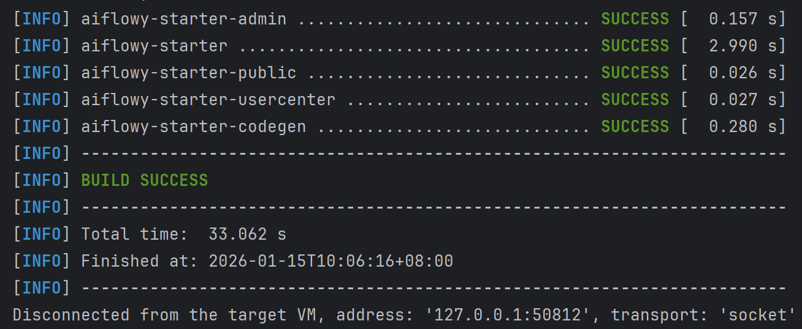
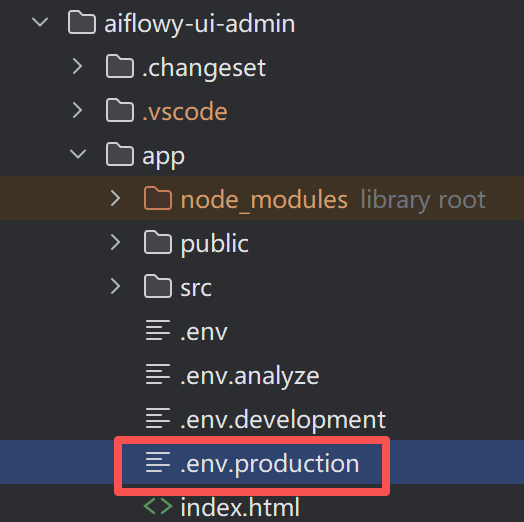
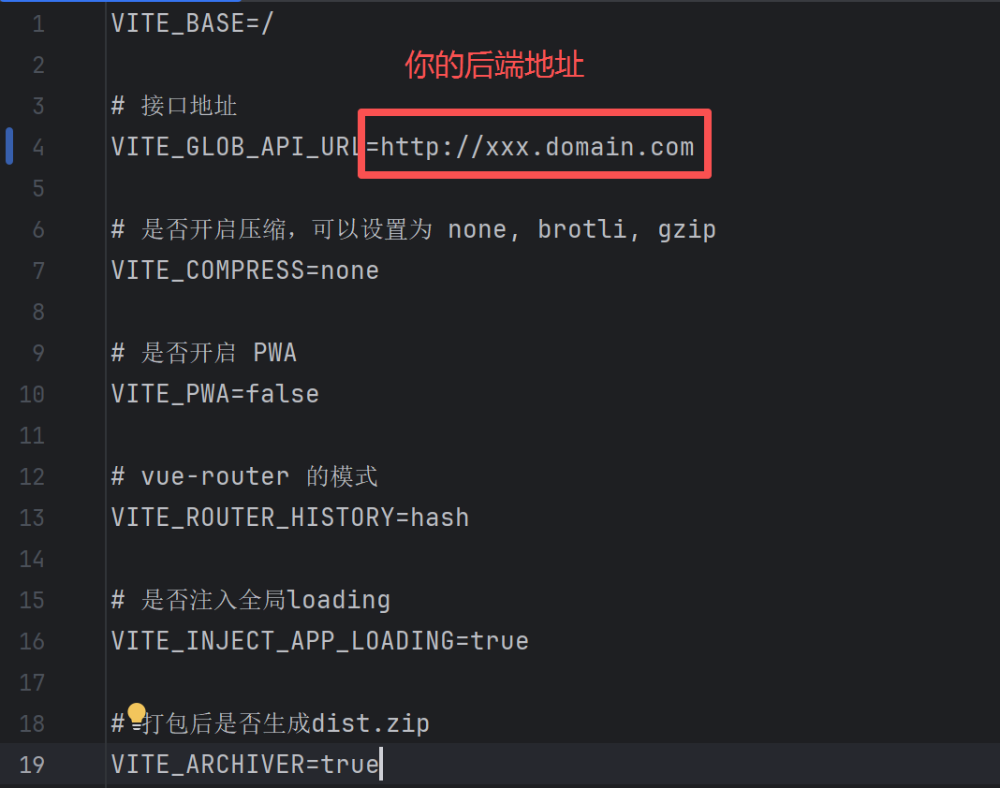

# 项目部署

## 部署后端

- 根据生产环境修改 `application-prod.yml` 文件
- 在项目根目录运行：`mvn clean package -DskipTests` 命令，等待后端项目打包完成。
- 控制台看到 `BUILD SUCCESS` 字样表明项目打包成功：

- 在 `aiflowy-starter-all/target` 目录下，会生成一个 `aiflowy-starter-all-x.x.x.jar` 的 jar 包。
将该 jar 包复制到服务器，即可通过 java -jar 命令进行启动。
```
/java/jdk-17.0.8/bin/java -jar -Xmx1024M -Xms256M  /aiflowy-v2/aiflowy-starter-all-x.x.x.jar --server.port=[可指定运行端口号] --spring.profiles.active=prod
```
其中 `/java/jdk-17.0.8/bin/java` 是 JDK 路径，可根据实际情况修改，要求必须是 JDK17 以上，如果默认 JDK 版本满足条件，可直接使用 `java` 命令运行。

其余运行参数请根据实际情况进行修改。
## 部署前端
### 管理页面
- 找到配置文件 `aiflowy-ui-admin > app > .env.production`

- 修改 `VITE_GLOB_API_URL` 为你的后端项目的访问地址

- 进入 `aiflowy-ui-admin` 目录，执行 `pnpm build` 命令。
- `aiflowy-ui-admin > app` 目录下会出现一个压缩好的 `dist.zip` 文件。

我们复制静态文件到 nginx 目录下即可运行。 或者亦可以直接使用阿里云 OSS 来部署我们的静态文件内容。
### 用户中心页面
- 找到配置文件 `aiflowy-ui-usercenter > app > .env.production`
- 修改 `VITE_GLOB_API_URL` 为你的后端项目的访问地址
- 进入 `aiflowy-ui-usercenter` 目录，执行 `pnpm build` 命令。
- `aiflowy-ui-usercenter > app` 目录下会出现一个压缩好的 `dist.zip` 文件。
### 部署到 Nginx

> 需先安装 nginx

 Nginx 配置：
```shell
server {
   ...
   
   location / {
      root /aiflowy/page;
      try_files $uri $uri/ /index.html;
    }
    
    # 如果你的后端地址无法直接访问，需要反向代理，配置以下参数：
    location /api {
      proxy_pass http://127.0.0.1:8080;
      proxy_set_header Host $host;
      proxy_set_header X-Real-IP $remote_addr;
      proxy_set_header X-Forwarded-For $proxy_add_x_forwarded_for;
      proxy_set_header X-Forwarded-Proto $scheme;
    }
    # nginx 配置问题千奇百怪，遇到问题，可以参考官方文档或者询问AI
    
    ...
}
```
将编译好的 `dist.zip` 传到服务器的 `/aiflowy/page` 目录下，
运行命令将编译好的所有文件解压到 `/aiflowy/page` 目录即可。
```
cd /aiflowy/page
unzip dist.zip
```

## Docker 部署
请参考项目根目录下的 `DEPLOY.md` 文件。
