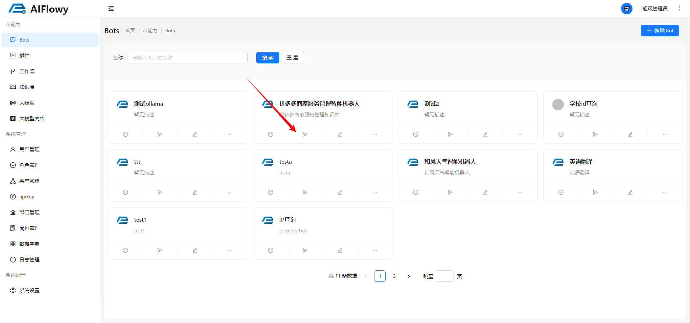
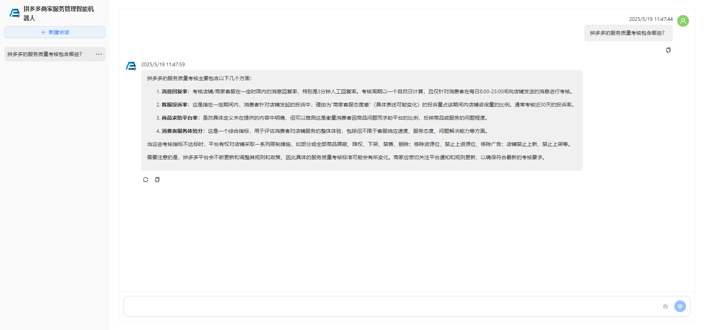

# Bot web 客户端

Bot Web 客户端是指专门为机器人 Bot 设计的基于网页的用户界面或操作平台。它的主要功能是让用户能够通过浏览器来管理、控制和与自动化程序(机器人)进行交互。

## 如何进入Bot Web 客户端
点击如下所示的按钮，进入 Bot Web 客户端

## Bot Web 界面
这里是 Bot Web 界面，这个 Bot 包含了 **对话**、**插件**、**工作流**、**知识库** 四个模块，分别对应 Bot 的对话、插件、工作流、知识库功能。
用户输入想要提问的问题，点击 **发送** 按钮，Bot 会根据用户输入的提问，主动判断是调用哪个插件还是调用哪个工作流，然后调用对应的插件或者工作流，得到结果，返回给用户。
