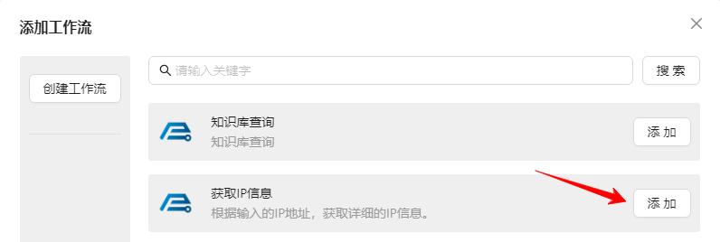
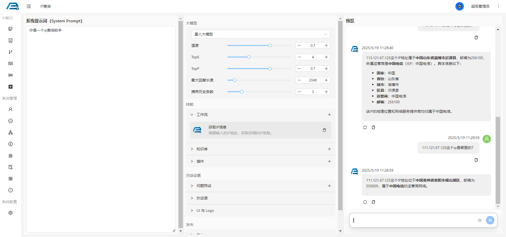

# 挂载工作流

## 1. 创建工作流
创建工作流请参考 [如何创建一个工作流](/zh/product/workflow/quick_start)

## 2. 挂载工作流
挂载工作流首先点击左侧菜单栏的 Bot 进入 Bot 对话页面，挂载工作流之前，我已经创建了一个名为 **获取IP信息** 的工作流，然后点击 **工作流** 右上角的 **+** 按钮，选择刚才创建好的 **获取IP信息**，点击 **添加**， 这样就给我们的智能机器人挂上了工作流。

## 3. 工作流测试
如下结果为 Bot 从挂载的工作流得到的结果
