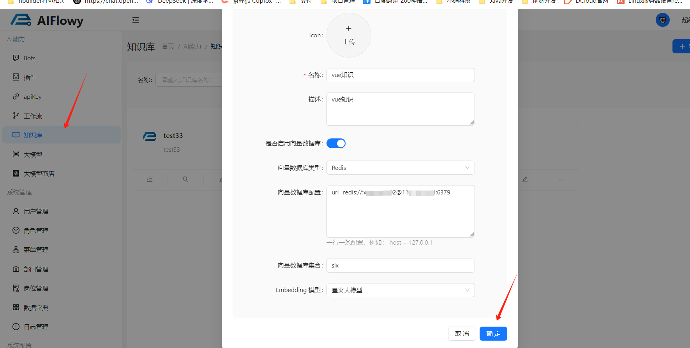
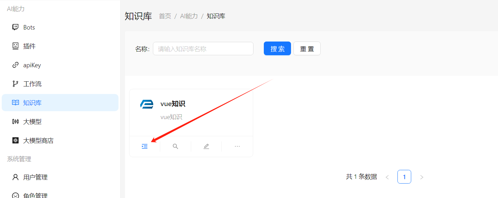
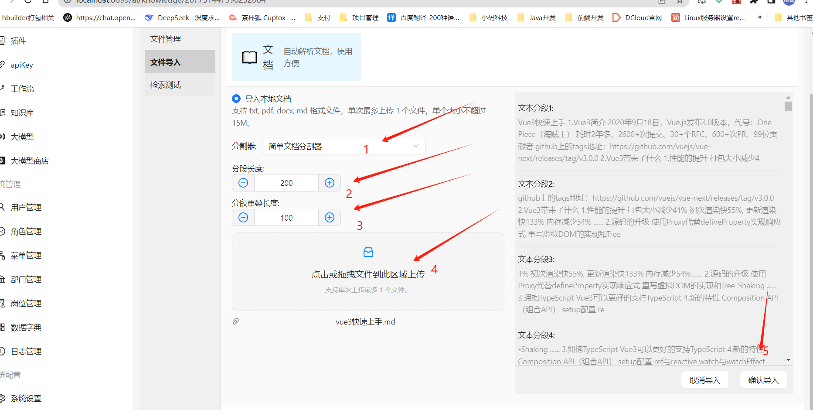
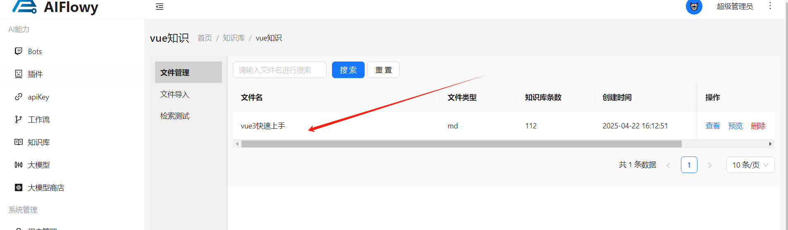
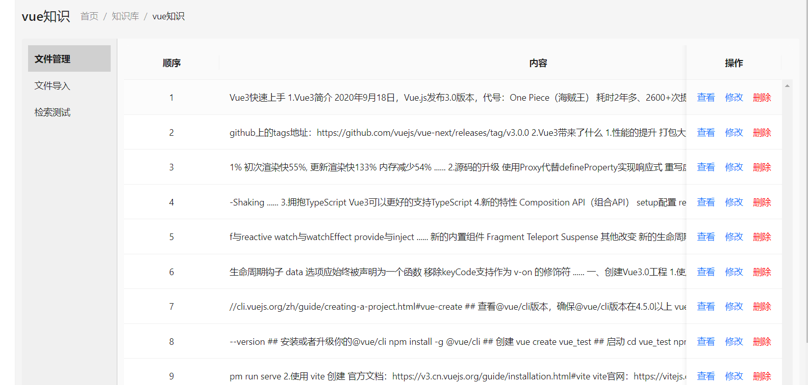
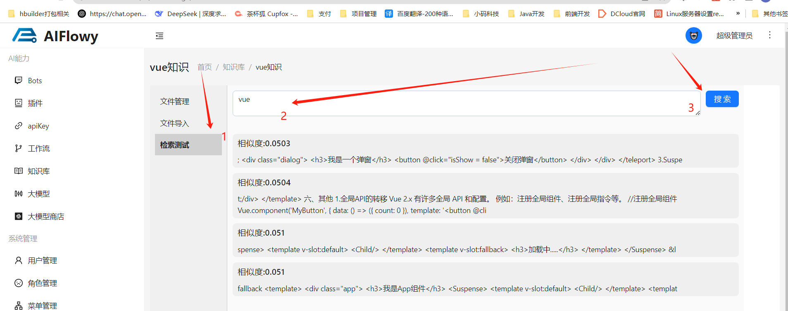

# 快速开始

## 创建知识库

1、创建知识库并且配置向量数据库，Embedding 模型，这里使用redis-stack向量数据库，然后保存

2、进入知识库

## 创建知识库文档

1、选择文件导入菜单，先选择文档分割器，设置文档分割长度，然后选择文件后预览分割效果，最后点击确认导入就能将文档导入知识库了

2、点击**文件管理**， 可以看到导入的文档，点击**查看**按钮，就可以看到文档内容了

3、点击查看，可以看到文档分割的段落

## 文件检索

1、点击**检索测试**，输入想要检索的关键字，可以看到检索结果及返回的相似度

