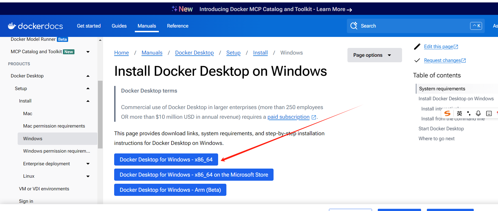
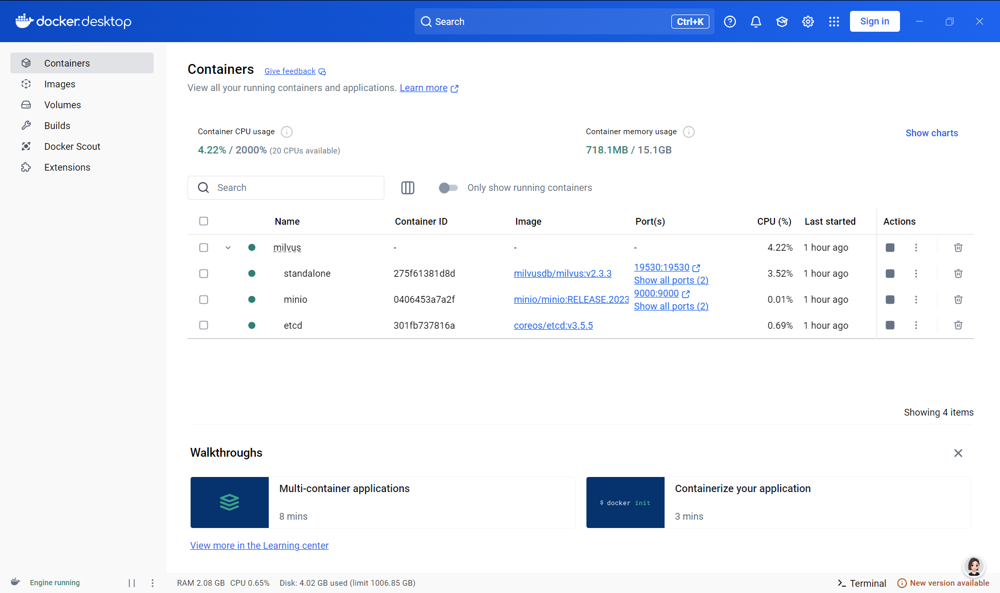
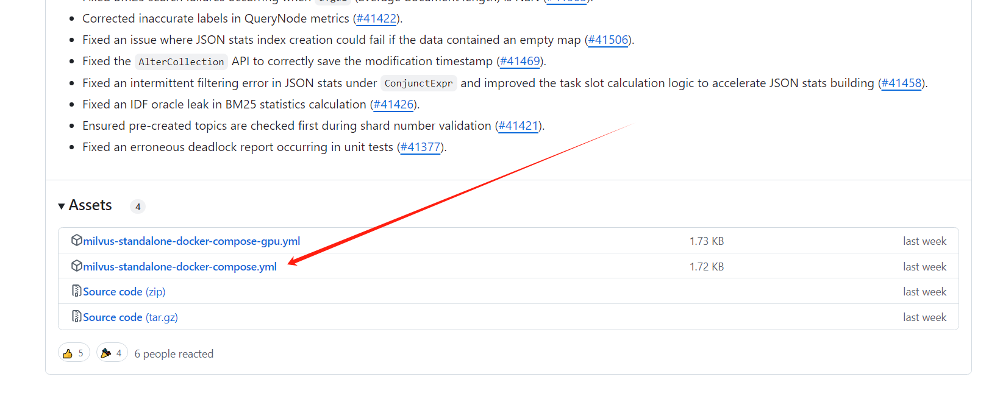
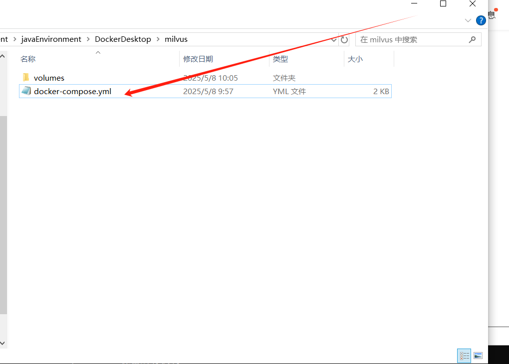
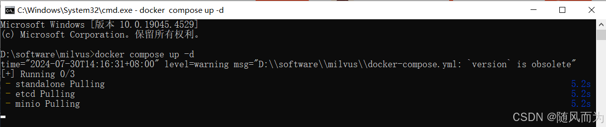
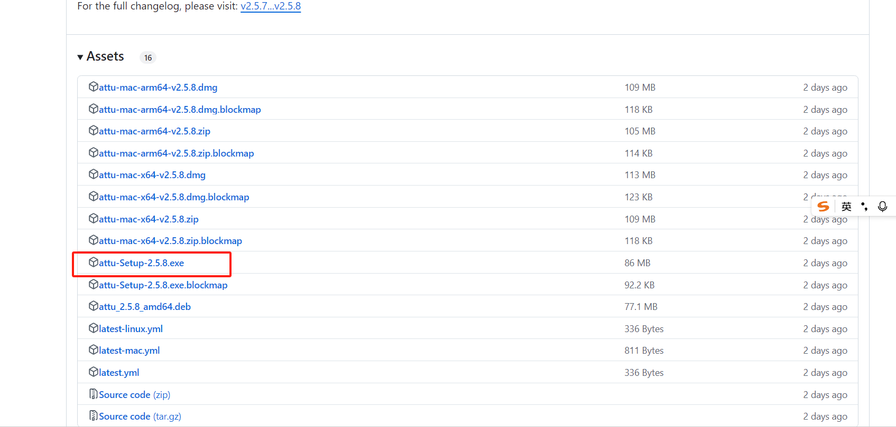
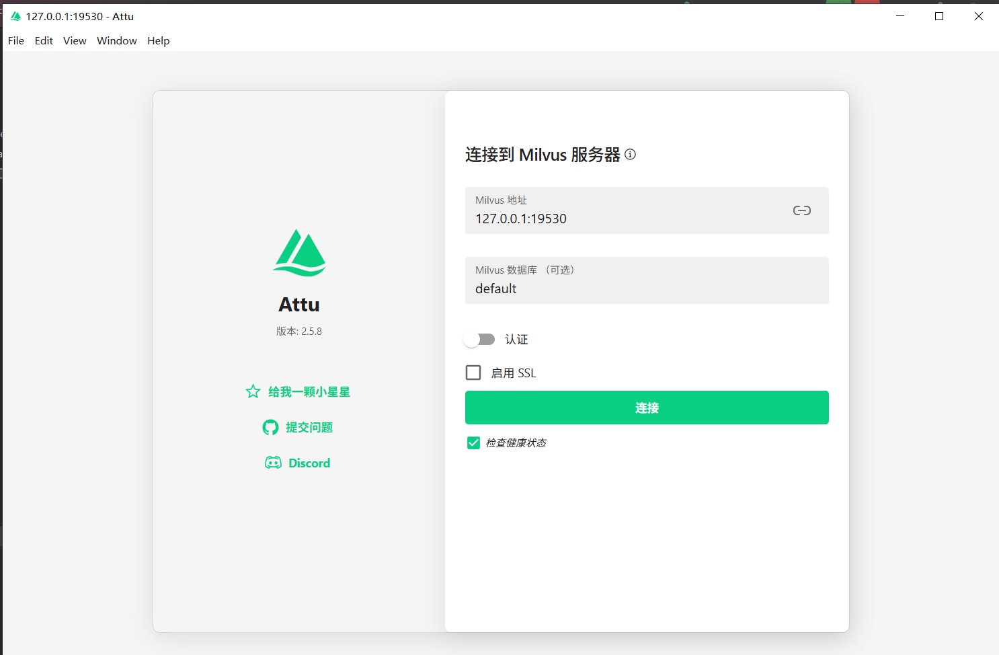
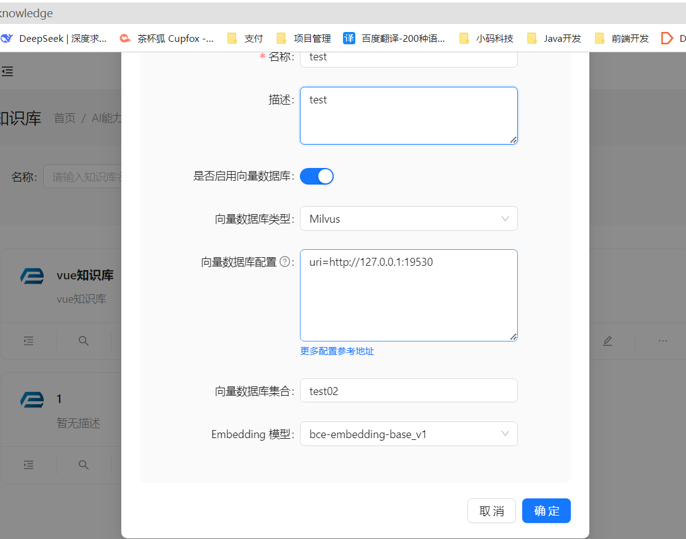
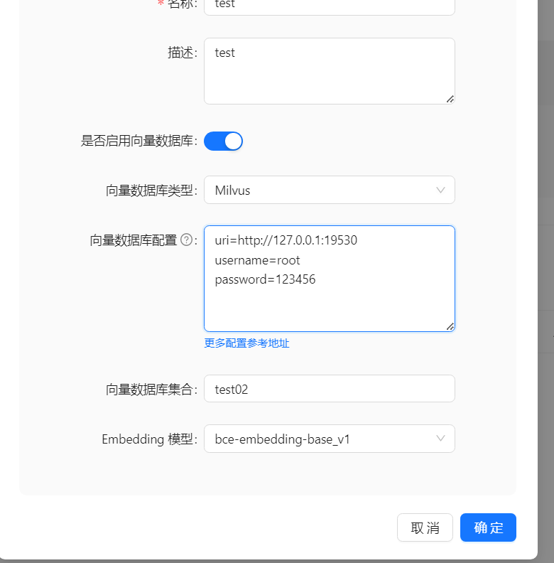
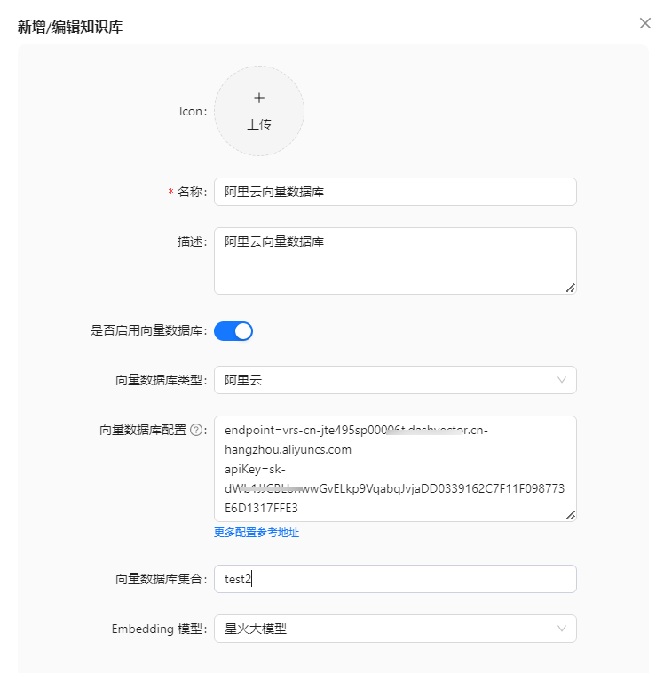

# 向量数据库

## Redis向量数据库

## 1. 部署Redis向量数据库

Redis向量数据库是包含redisSearch功能组件的Redis,这里使用docker版实现快速部署

```java
docker run --name  redis_stack  -e REDIS_ARGS="--requirepass Test2025L" -p 6379:6379  -d --restart=always redis/redis-stack-server:latest
```

## 2. 知识库页面配置

向量数据库类型选择Redis,向量数据库配置中填写uri = redis://:Test2025L@127.0.0.1:6379，向量数据库集合中填写知识库英文缩写如：redisKnowledge,Embedding 模型中选择一个模型（大模型菜单中能力是Embedding的模型）


扩展：向量数据库配置中还可以增加storePrefix、defaultCollectionName 等配置，配置了defaultCollectionName 时新增/编辑知识库页面中的“向量数据库集合”可以为空。

```java
storePrefix = docs:
defaultCollectionName = documents
```
## 3. 文件导入

## 4. 检索测试


## Milvus 向量数据库

## 1. 安装 DockerDesktop
这里介绍windows使用 dockerDesktop 部署 Milvus 向量数据库

1. 安装dockerDesktop , 点开连接，直接点击Download for Windows即可下载
   https://docs.docker.com/desktop/setup/install/windows-install/



2. 下载好了安装，直接安装即可。安装完了打开Docker可视化页面。
   如果页面为以下内容则表示成功(如果页面空白，则需要设置网络，保证能访问docker镜像仓库):



验证是否安装成功
```cmd
#查看docker版本
docker --version
#查看docker-compose版本
docker-compose --version
```

## 2. 部署 Milvus 向量数据库

1. Milvus下载
   从链接中: 下载选择自己所需的版本即可，这里我选择的是最新版本milvus-2.5.11
   https://github.com/milvus-io/milvus/releases/tag/v2.5.11



在你的本地建立一个milvus文件夹，将下载好的文件拷贝至刚刚创建的milvus下，并改名为：docker-compose.yml。记得一定要改名，不然会报错。



2. Milvus启动与验证
   打开cmd命令行，进入docker-compose.yml文件所在的目录。
   输入命令： docker compose up -d，这里记得设置自己的网络，不然加载不了。



## 3. Milvus 图形化界面attu的安装

1. attu下载
   大家可以点击下载attu选择自己所需的版本，我使用的为最新版本Release v2.4.6

https://github.com/zilliztech/attu/releases/tag/v2.5.8



2. attu安装
   下载安装文件后，直接安装就行。安装后打开的页面是这样：



## 4. Milvus 向量数据库配置
**Milvus 向量数据库配置**
1. 以下为未设置密码的配置样例：



2. 以下为设置了密码的配置样例：



**此外 Milvus 还支持更多配置参数**

databaseName = "default" 数据库集合名称，默认为default

token ：使用token认证，默认为空，为空则不使用token认证

## Elasticsearch 向量数据库

## 1. Elasticsearch 知识库配置样例

如果没有设置账号和密码，不用添加账号和密码的配置


此外  Elasticsearch 还支持更多配置参数
apiKey ：使用apiKey认证，默认为空，为空则不使用apiKey认证

## OpenSearch 向量数据库

## 1. 安装OpenSearch

docker 安装参考地址

https://docs.opensearch.org/docs/latest/install-and-configure/install-opensearch/docker/#windows-settings

docker 使用如下如下命令一键设置密码并安装

```cmd
docker run -d -p 9200:9200 -p 9600:9600 -e "discovery.type=single-node" -e "OPENSEARCH_INITIAL_ADMIN_PASSWORD=yourPassword" opensearchproject/opensearch:2.19.1
```

浏览器向 9200 端口发送请求。默认用户名为 admin ，密码为您设置的密码。

出现以下内容则表示成功


## 2. OpenSearch 知识库配置样例


## 阿里云 向量数据库

## 1. 登录阿里云配置向量数据库，并创建集合名称

注意：集合名称需要先在阿里云上创建，才能配置在AIFlowy中

## 2. 阿里云向量数据库配置样例
