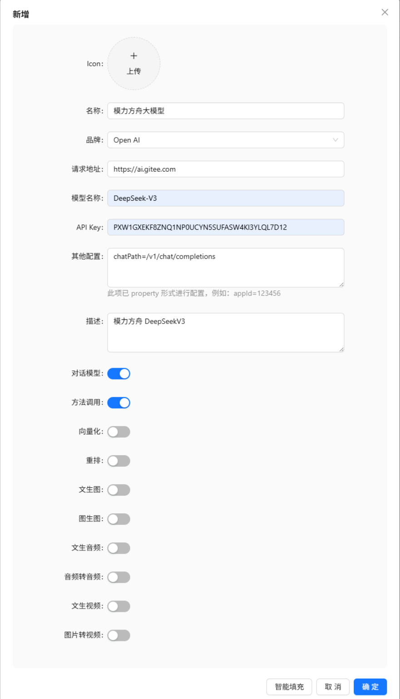
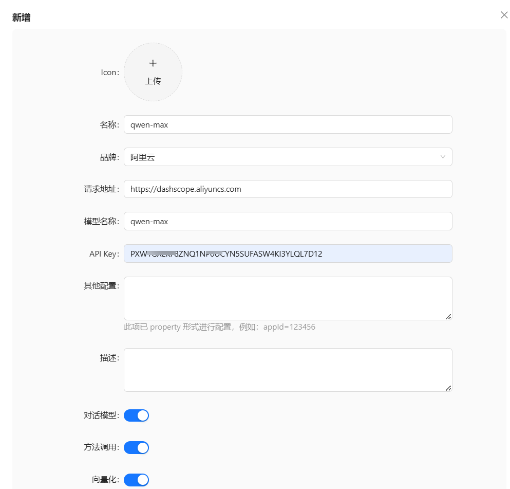
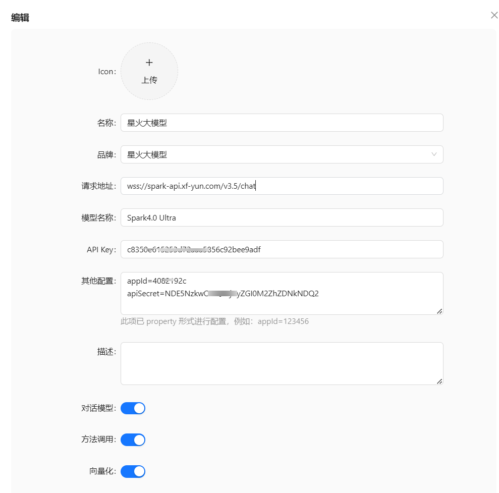
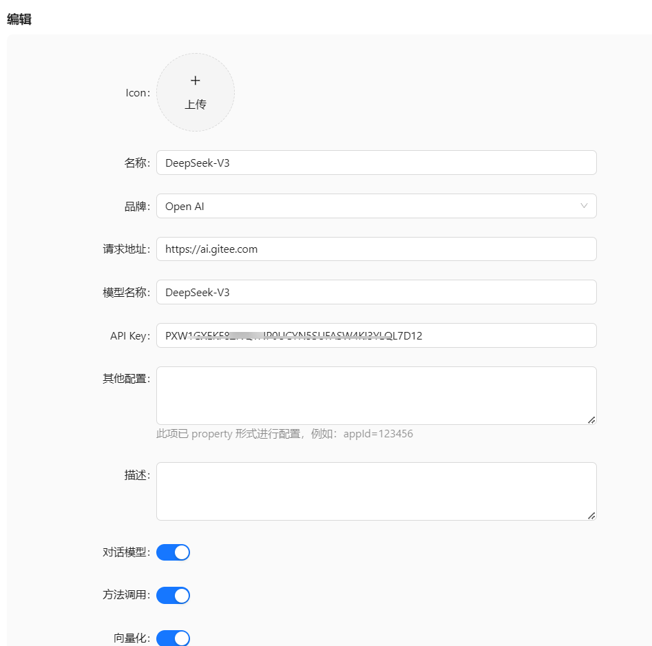
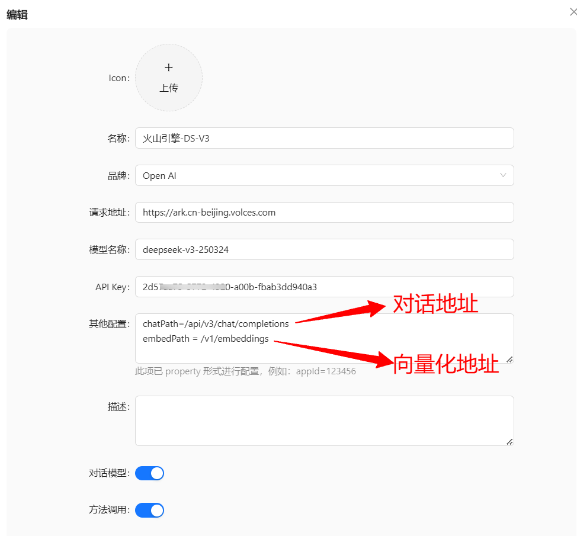

# 模型接入

## 添加大模型

我们添加一个模型作为示例。

比如，我们要添加一个`模力方舟`的 `deepseek v3` 模型，那么参数如下：



因为`模力方舟`的大模型接口兼容了`openai`，所以我们可以直接使用兼容`openai` 的接口。

但是因为各家厂商的 `chatPath` 不一样，所以需要配置一下。

如果品牌列表支持的厂商，那么只需配置该厂商所需的参数即可。

比如星火大模型，除了 `apiKey`，还需要配置  `appId` 和 `apiSecret`，那么这些额外的参数也是要以 `property` 的形式来配置：
```
appId=xxx
apiSecret=xxx
```
> 需要注意的是，只有 `openai` 方式才支持配置chatPath，其他厂商 `path` 都是固定的。

## 阿里云百炼

接入阿里云大模型 请点击 [阿里云百炼地址](https://bailian.console.aliyun.com/?tab=model#/model-market)

在 AIFlowy 中配置 **阿里云** 品牌的模型配置参考如下图



## 星火大模型
接入星火大模型 请点击 [星火大模型地址](https://passport.xfyun.cn/login)
在 AIFlowy 中配置 **星火大模型** 品牌的模型配置参考如下图



## 模力方舟
接入模力方舟大模型 请点击 [模力方舟地址](https://ai.gitee.com/serverless-api)
请注意：模力方舟的品牌请选择 **Open AI**



## 火山引擎
接入模力方舟大模型 请点击 [火山引擎地址](https://www.volcengine.com/)
请注意：火山引擎的品牌请选择 **Open AI**




