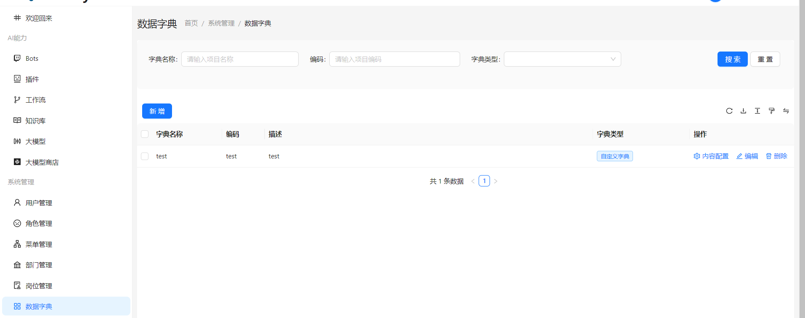

# 数据字典

## 前言

数据字典是在一个系统中，常用描述或存储一些固定的业务数据，比如性别、年级等固定的信息。在 AIFlowy 中，有一个数据库字典的模块，用于管理数据字典，如下图所示：



## 数据字典的类型

在 AIFlowy 中，有如下几种类型的数据字典：

- **枚举类字典**：用 Java 定义的枚举类来当做数据字典。
- **数据表字典**：使用某张表的数据来当做数据字典。
- **Dict 表数据字典**：自己添加数据到表 `tb_sys_dict` 以及 `tb_sys_dict_item` 来当做数据字典。
- **自定义数据字典**：通过实现 `DictLoader` 来当做数据字典。

## DictLoader 示例代码

以下代码中，用于定义一个名为 `"sysPositions"` 的数据字典，前端可以通过接口传入 `"sysPositions"` code 读取到该数据字典的内容。

```java
@Component
public class SysPositionDict implements DictLoader {
    @Override
    public String code() {
        return "sysPositions";
    }

    @Override
    public Dict load(String keyword, Map<String, String[]> parameters) {
        QueryWrapper queryWrapper = new QueryWrapper();
        queryWrapper.select("id", "name");
        queryWrapper.in("dept_id", parameters.get("deptIds"));
        List<Row> rows = Db.selectListByQuery("tb_sys_position", queryWrapper);
        List<DictItem> items = null;
        if (rows != null) {
            items = new ArrayList<>(rows.size());
            for (Row row : rows) {
                DictItem dictItem = new DictItem();
                dictItem.setValue(row.get("id"));
                dictItem.setLabel(String.valueOf(row.get("name")));
                items.add(dictItem);
            }
        }
        Dict dict = new Dict();
        dict.setCode("sysPositions");
        dict.setItems(items);
        return dict;
    }
}
```

## 字典数据的读取

在 AIFlowy 中，提供了一个用于读取数据字典的接口：/api/v1/dict/items/{code} 。用于传入字典 code 读取数据字典。