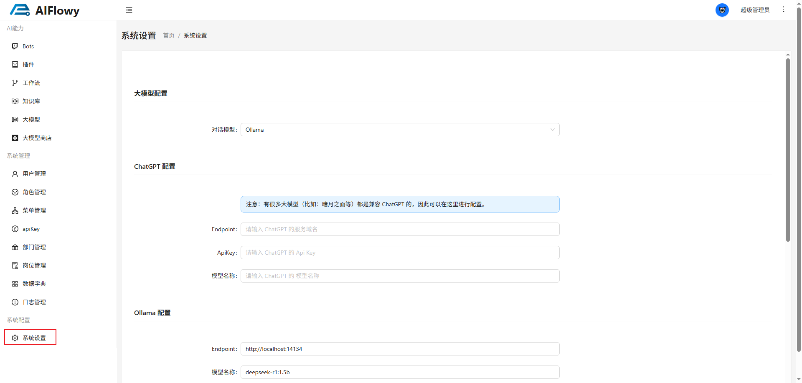
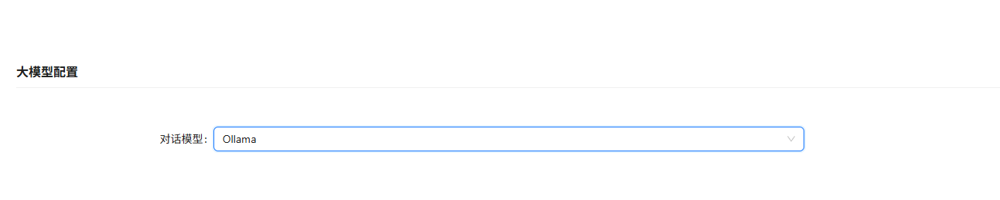
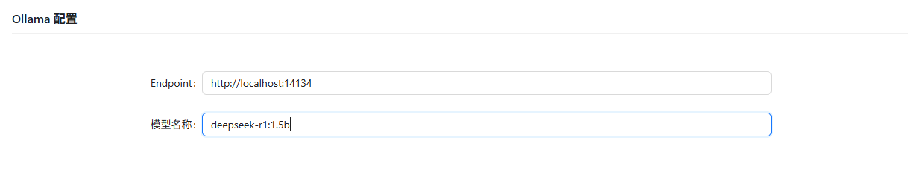
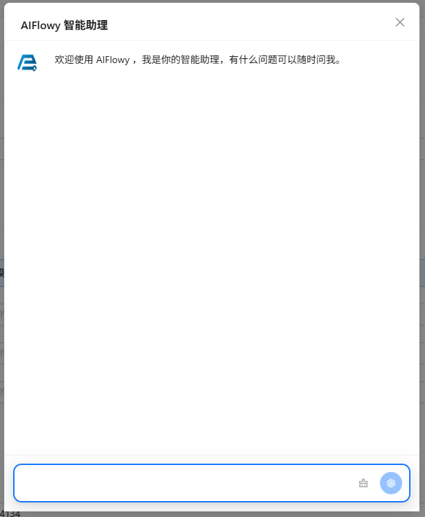

# 系统设置
在系统设置中，可以配置后台系统对话使用的大模型，以及大模型的一些配置。

## 操作流程
进入系统设置界面后，在大模型配置 -> 对话类型中选择模型。

选择模型后，在页面下方找到对应的配置项进行配置，如上图中所选的模型为`ollama`，那么就在下方找到`ollama`配置项。

配置完成将页面滚动到最底部点击保存按钮。

至此就可以点击系统右上角的机器人图标进行大模型对话了。

