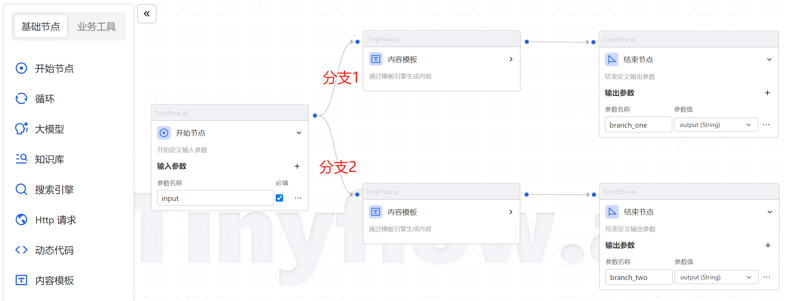
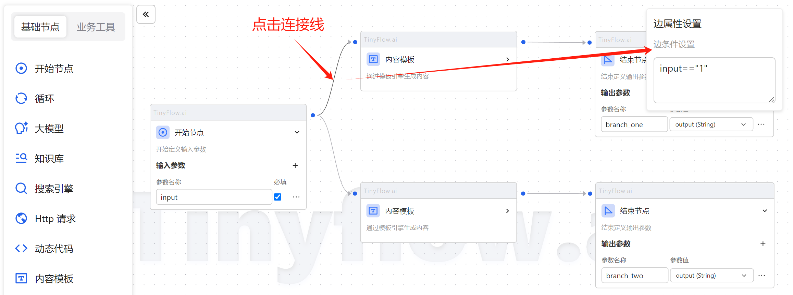
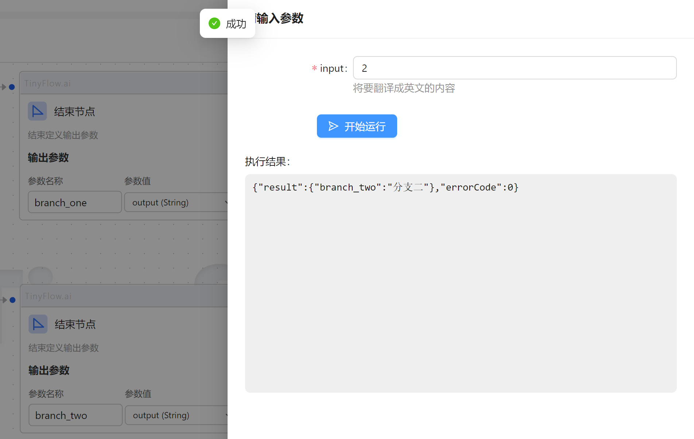
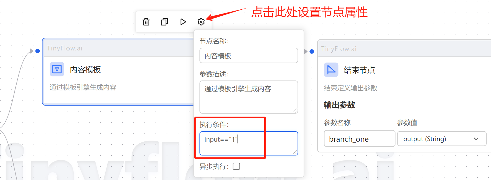

# 执行条件

工作流中，可以通过执行条件来控制节点的运行。

## 语法说明

编写执行条件的语法完全遵循 `JavaScript` 的语法。

## 边属性设置

在 AIFlowy 中，并没有条件节点的概念，条件分支可以通过边属性设置来控制。

下面举一个例子来演示边属性的设置。

如图，先定义一个工作流，并设置为两个分支：

点击分支 1 的连接线，会弹出边属性设置的输入框：

我们将分支 1 的执行条件设置为 `input=="1"`

再将分支 2 的执行条件设置为 `input=="2"`

然后点击 `试运行`，输入 `2`，可以看执行结果为 `branch_two`：

## 节点执行条件

写法和边条件一样，满足条件才会执行该节点。

