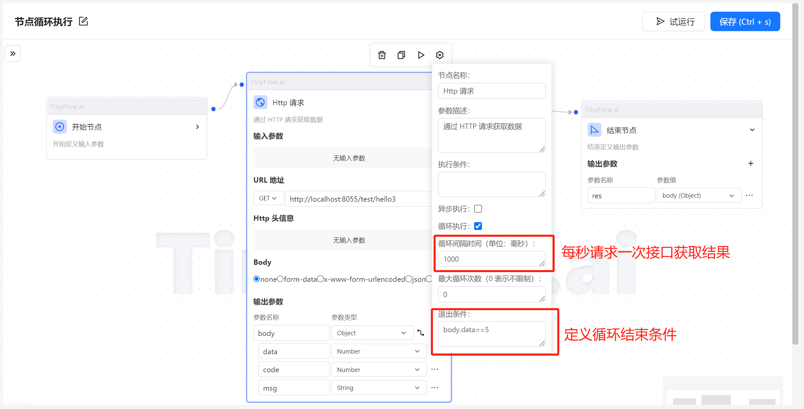
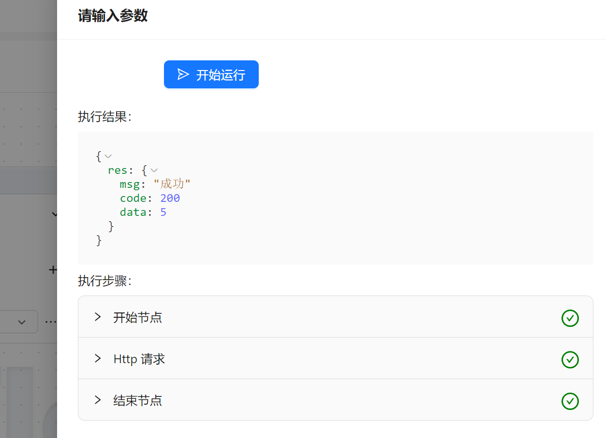

# 节点循环执行

在工作流执行的过程中，有这样一个场景，其中某个节点需要循环执行。

当达到某种期望的结果或者某种条件时才继续往下面执行。

比如执行一个异步任务，我们需要不断的去获取这个任务的执行结果。

当任务执行完成后再进行下一步操作。

下面就通过一个示例来演示一下节点的循环执行功能。

## 示例

定义一个接口，模拟一个异步任务，当返回数字5的时候代表任务结束。

```java
    @GetMapping("/hello3")
    public Res<Integer> test3() {
        int i = new Random().nextInt(10);
        System.out.println("结果："+i);
        return Res.ok("成功",i );
    }
```

添加一个工作流：



可以看到，当接口返回结果为5的时候，循环结束，流程执行完毕：



## 其他判断逻辑

除了可以判断节点执行的返回值以外，还可以通过节点上下文 `_context` 的一些方法来作为跳出循环的条件。

`_context.getTriggerCount()` 方法可以获取节点触发的次数。

`_context.getExecuteCount()` 方法可以获取节点已经执行的次数。

比如我希望节点执行10次后结束循环，那么判断条件就可以写为：`_context.getExecuteCount()==10`

以上方法可以根据业务需求来作为跳出循环的判断条件。


