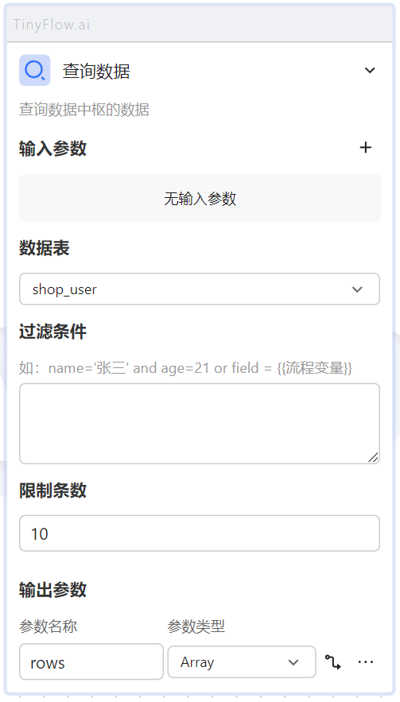
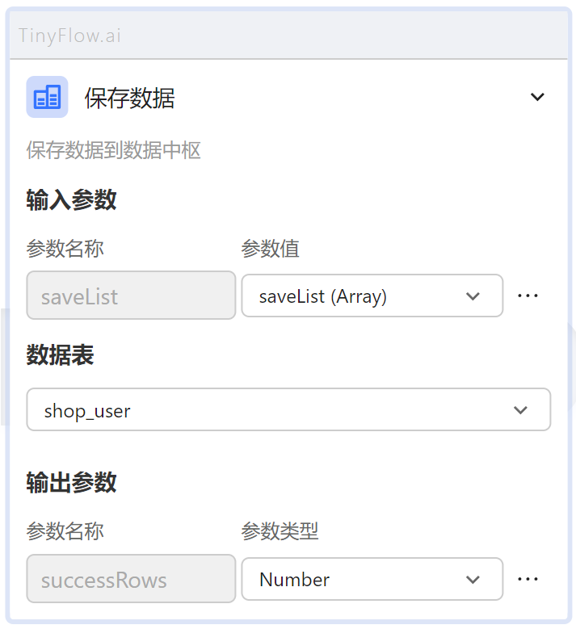
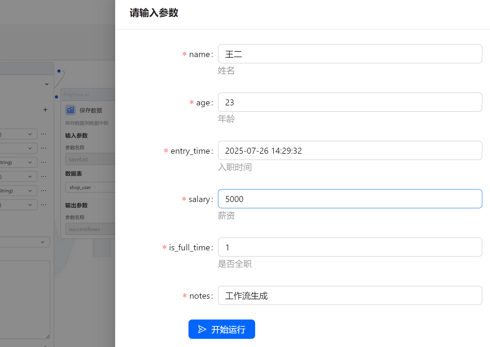
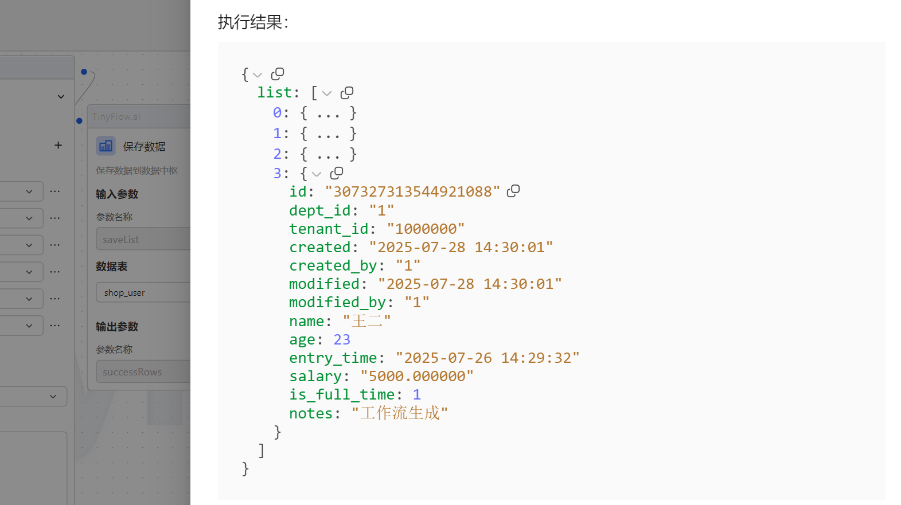

# 数据节点

`保存数据` 节点可以将工作流中产生的数据保存到数据中枢里面，并且通过 `查询数据` 节点可以查询数据中枢里面的数据。

## 查询数据

可根据一定的过滤条件查询数据，过滤条件就是 sql 中的 where 部分。

## 保存数据

传入待保存的列表，可以保存到对应的数据表当中，要求字段必须和数据中枢那边定义的保持一致。

## 示例

### 保存并查询

1.定义一个工作流，如图。

2.运行工作流。

3.执行结果可以看到刚才添加的数据已经保存到了对应的数据表当中。

