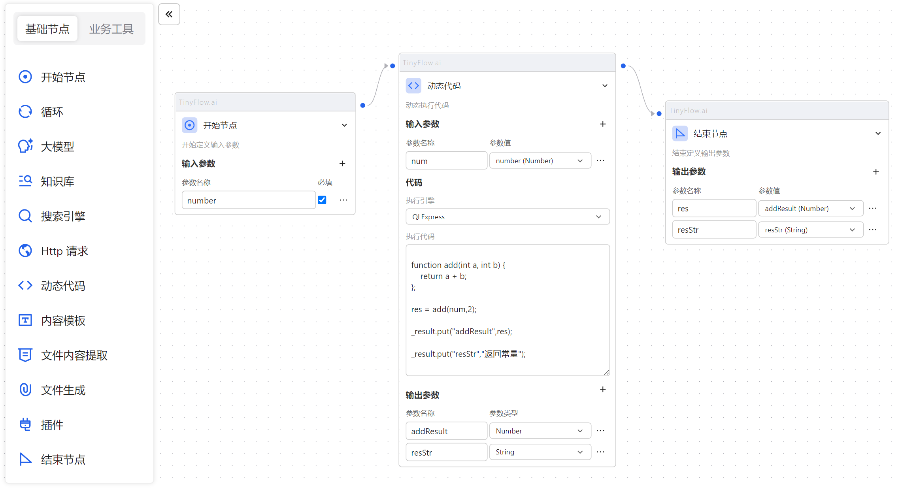
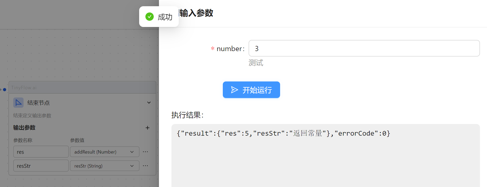
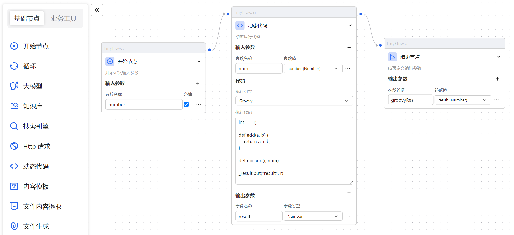
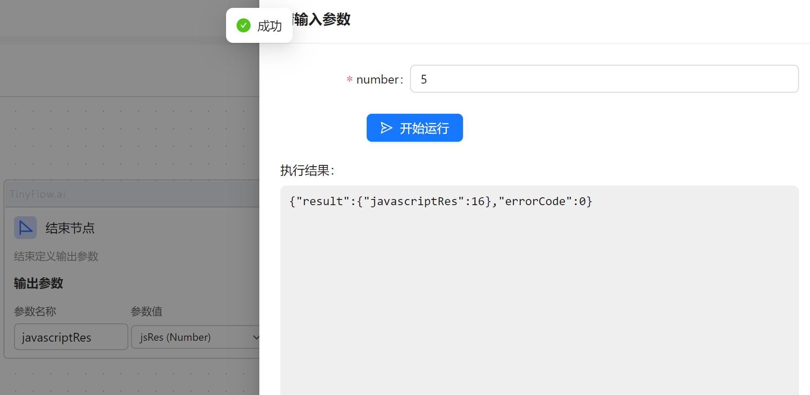

# 动态代码

动态代码节点允许用户编写自定义代码逻辑，并将其嵌入到执行链中。

## 支持的语言

### QLExpress

#### 简介

QLExpress 是由阿里的电商业务规则演化而来的嵌入式 Java 动态脚本工具，在阿里集团有很强的影响力，
同时为了自身不断优化、发扬开源贡献精神，于2012年开源。

在基本的表达式计算的基础上，增加以下特色功能：

灵活的自定义能力，通过 Java API 自定义函数和操作符，可以快速实现业务规则的 DSL

兼容Java语法，最新的 QLExpress4 可以兼容 Java8 语法，方便 Java 程序员快速熟悉

友好的报错提示，无论是编译还是运行时错误，都能精确友好地提示错误位置

默认安全，脚本默认不允许和应用代码进行交互，如果需要交互，也可以自行定义安全的交互方式

解释执行，不占用 JVM 元空间，可以开启缓存提升解释性能

代码精简，依赖最小，适合所有 java 的运行环境

#### 示例

下面是一个简单示例：



执行代码：
```
function add(int a, int b) {
    return a + b;
};

res = add(num,2);

_result.put("addResult",res);

_result.put("resStr","返回常量");
```
运行结果：



### Groovy

#### 简介

Groovy 是一种基于 JVM （Java虚拟机）的敏捷开发语言，它结合了 Python、Ruby 和 Smalltalk 的许多强大的特性，
Groovy 代码能够与 Java 代码很好地结合，也能用于扩展现有代码。由于其运行在 JVM 上的特性，
Groovy 也可以使用其他非 Java 语言编写的库。

#### 示例

下面是一个简单的示例：



执行代码：
```
int i = 1;

def add(a, b) {
    return a + b;
}

def r = add(i, num);

_result.put("result", r)
```

运行结果：


### JavaScript

#### 简介
JavaScript 是一种高级的、解释型的编程语言，主要用于网页开发，但如今已扩展到服务器端、移动应用和桌面应用开发。

#### 示例

下面是一个简单的示例：


执行代码：
```
var a = 1;

for (var i=1; i<=num; i++) { 
    a+=i;
}

_result.put("jsRes", a);
```
运行结果：



## 输出参数

代码块中使用 `_result.put(key, value)` 的变量都可作为输出参数输出。