# 快速开始

## 创建工作流

点击新增按钮：

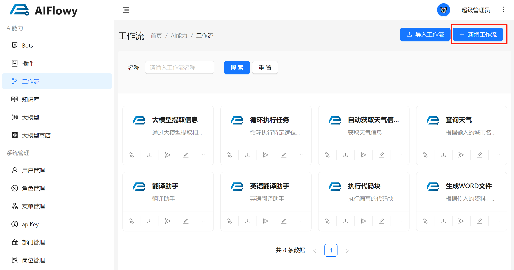

输入相关信息，点击保存：

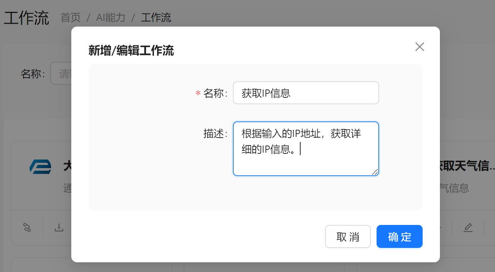

找到刚才添加的工作流，点击设计工作流按钮：

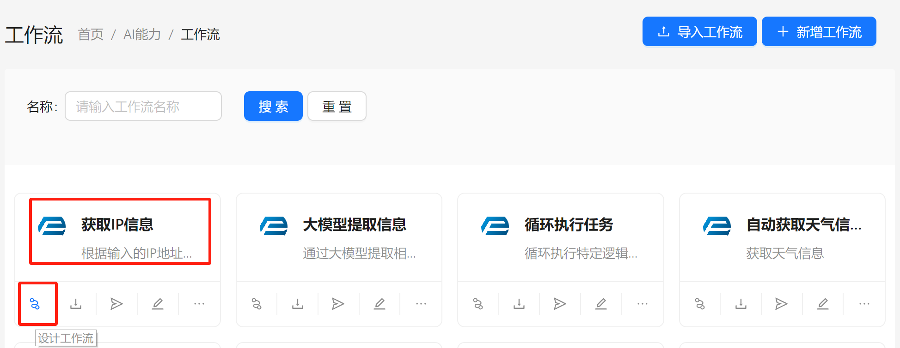

然后我们就来到了设计页面：

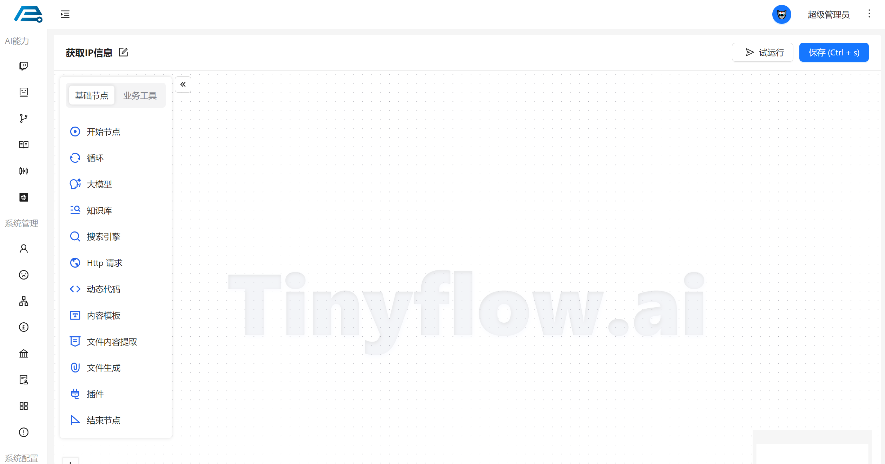

每个工作流需要一个开始节点，一个结束节点，至少一个中间节点，这个工作流才有意义。

要实现获取 IP 信息的功能，我们可以选择 `Http` 节点或者 `插件` 节点来实现。

这里我们以 `Http` 节点来作为演示：

- 添加开始节点：

拖动一个开始节点到画布上，然后配置所需要的字段：

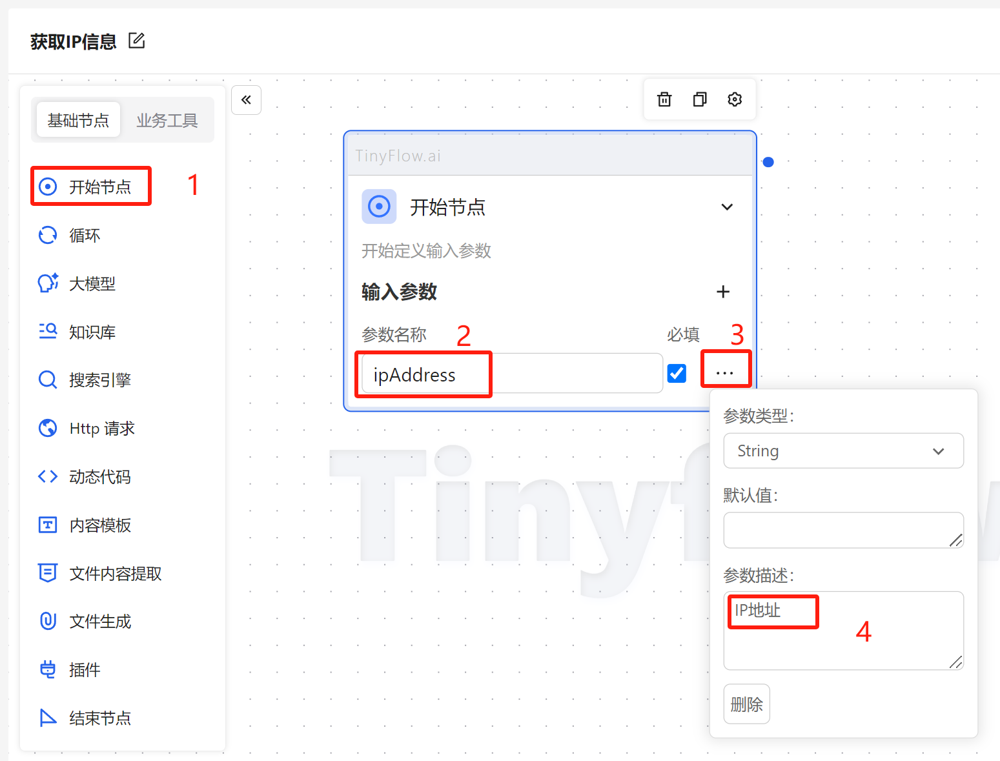

- 添加中间节点：

拖动一个 `Http` 节点到画布上，并将开始节点与之相连，然后配置所需要的字段：

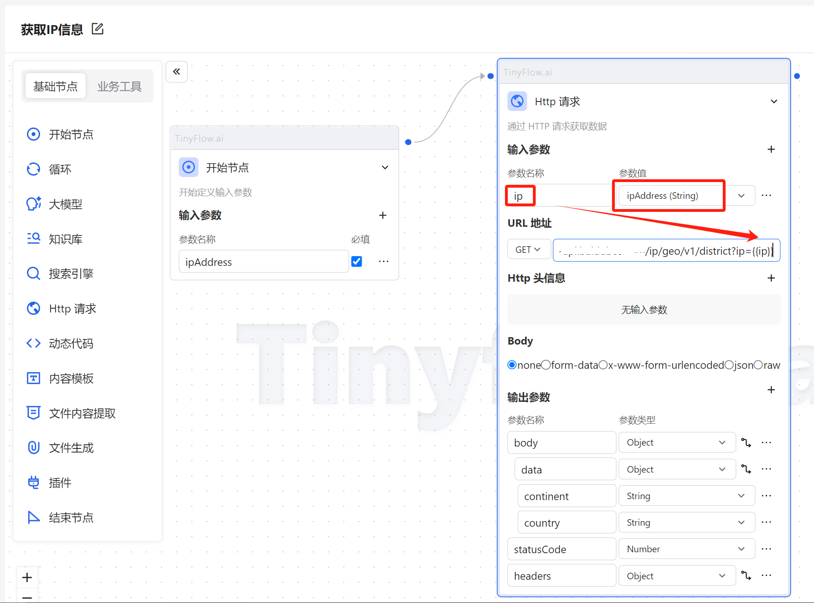
> 工作流上的所有变量，都可通过 {{propertyName}} 来引用，比如 {{ip}}

- 添加结束节点：

拖动一个结束节点到画布上，并将 `Http` 节点与之相连，并引用 `Http` 节点的输出变量中的 `data` 作为输出结果：

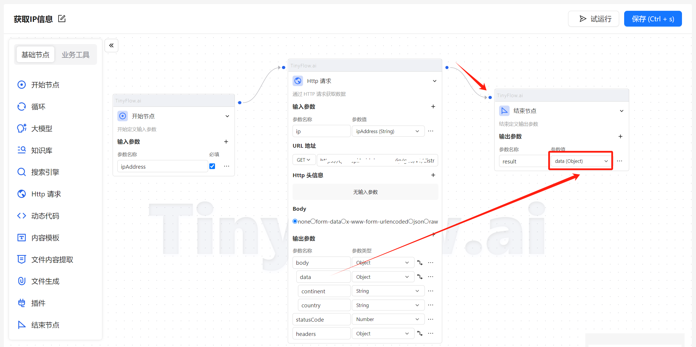

这样就定义好了一个工作流，可点击右上角的 `保存按钮` 或者 `Ctrl + S` 保存。

## 试运行工作流

点击右上角的 `试运行` 按钮，输入定义好的参数，点击 `开始运行` 即可：

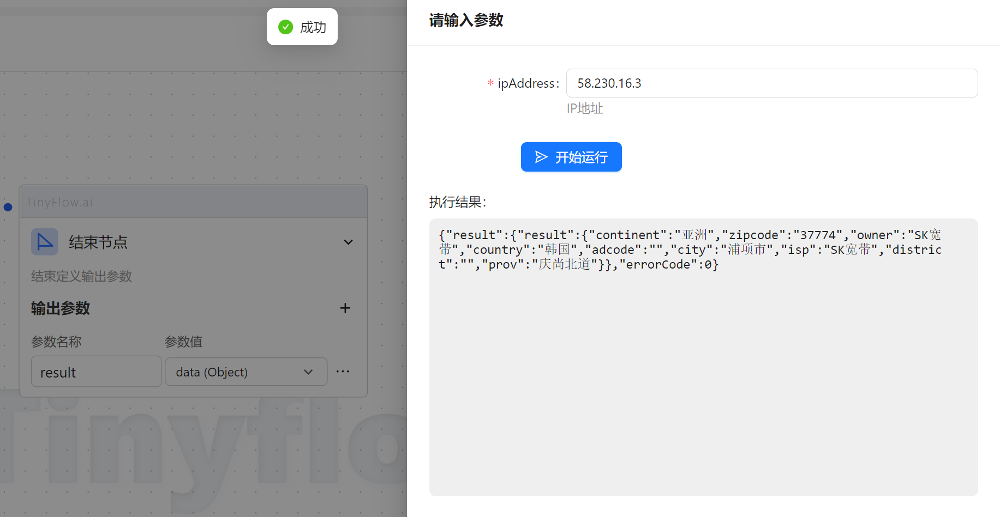

## 导入导出工作流

可以将定义好的工作流导出为 JSON 文件，方便分享工作流给其他人，与之对应的，也可以导入别人导出的工作流。

### 导出

点击导出按钮即可导出工作流的 JSON 文件：

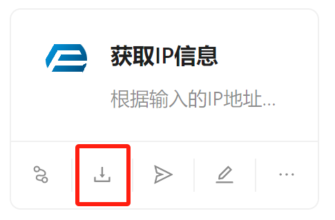
> 有的浏览器弹出下载比较慢，如果提示导出成功，就等待浏览器弹出下载框，不需要重复点击。

### 导入

点击右上角的导入工作流按钮，填入信息，选择要导入的 JSON 文件点击确定即可：

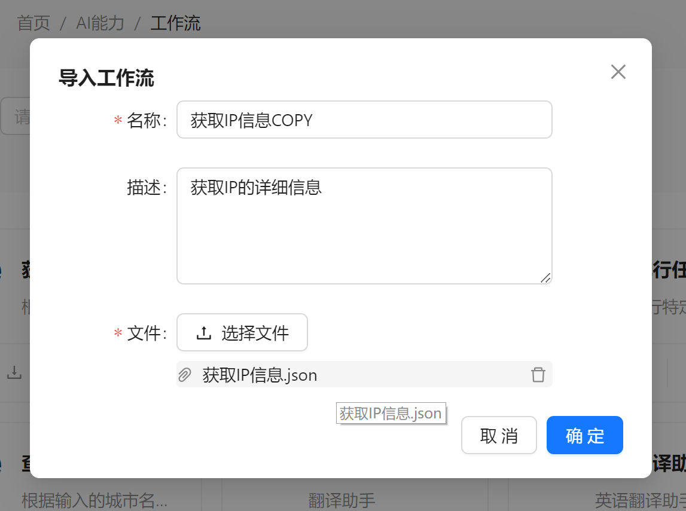

## 独立页面

工作流还可以在单独的页面打开，如图：

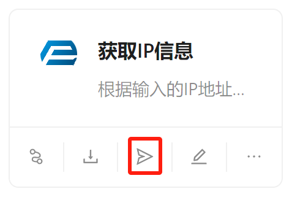

打开后如图所示：

> 单独访问此页面也需要登录。

